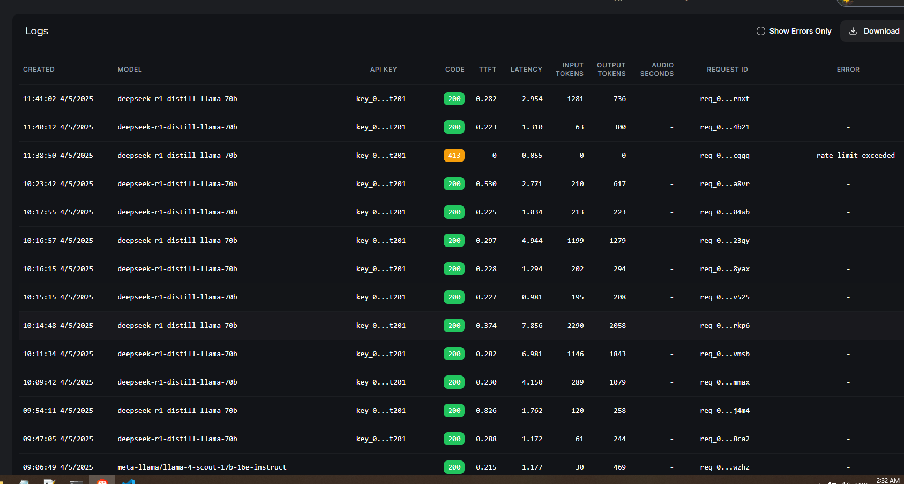
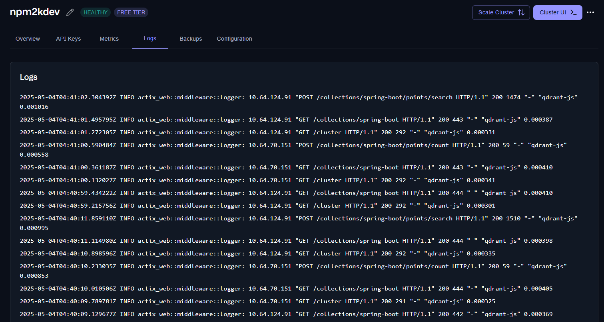
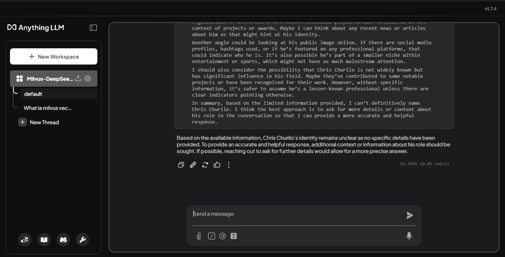

# Minimalist solution for smooth and free AI Assistant experience never worry about chat limit like gpt chat

## Tools applied

- **Windows 10 WSL2 22.04 LTS**
- **NVIDIA Toolkit**
- **Image: `michaelf34/infinity:0.0.70`** -> `embed-text-server`
- **Image: `Mintplex-Labs/anything-llm`** -> `center app`
- **Qdrant Cloud Free Tier** -> Vector database
- **Groq API + deepseek-r1-distill-llama-70b** -> LLM

## needed steps

### 1. tutorial CUDA development with NVIDIA

- [CUDA development with Docker](https://docs.nvidia.com/ai-enterprise/deployment/vmware/latest/docker.html)

### 2. Check for WSL2 supported version and reset WSL if needed

- [install Ubuntu](https://docs.docker.com/engine/install/ubuntu/)

### 3. install NVIDIA Container Toolkit

- [guide install NVIDIA Toolkit](https://docs.nvidia.com/datacenter/cloud-native/container-toolkit/latest/install-guide.html#installing-the-nvidia-container-toolkit)

### 4. note Reset Docker daemon don't work on WSL, use Docker Desktop instead of

- [check GPU & Docker](https://docs.nvidia.com/datacenter/cloud-native/container-toolkit/latest/sample-workload.html#running-a-sample-workload)

---

## API Key & services relatively

### 1. get Key API from Groq

- [get Key API Groq](https://console.groq.com/keys)
- choice Groq LLM from this: [Dashboard Limits](https://console.groq.com/dashboard/limits)

### 2. registration and start Qdrant Cloud instance free

- [registry Qdrant Cloud](https://cloud.qdrant.io/settings)
- note: choice Cluster in europe instead of north america if u are in asia.
- get endpoint & API key

---

## choice Model Embedding suitable with Hugging Face

- [Embedding Model: Nomic Embed Text v1.5](https://huggingface.co/nomic-ai/nomic-embed-text-v1.5)

---

## After successfully getting the api, reconfigure the environment for the docker-compose.yml file

### use nodejs run file jwt-secret-gen.js & change environment variable

```
node jwt-secret-gen.js
```

### finally start docker project & start [http://localhost:3001/](http://localhost:3000)

### too smooth and light for 16gb windows machine to code with ai assistant





## reference resources

- [Github: Anything-LLM](https://github.com/Mintplex-Labs/anything-llm/tree/master?tab=readme-ov-file)
- [Github: Infinity](https://github.com/michaelfeil/infinity)
